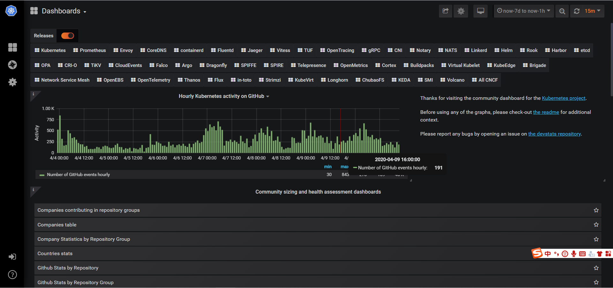
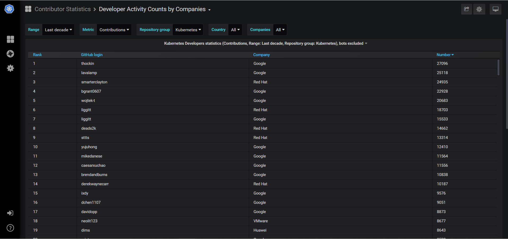
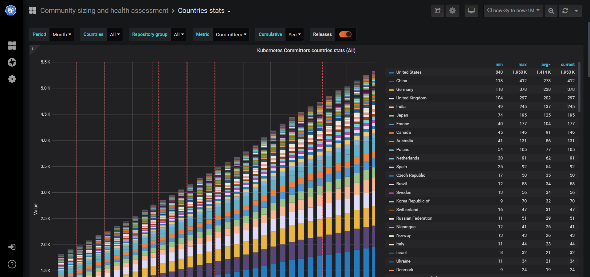
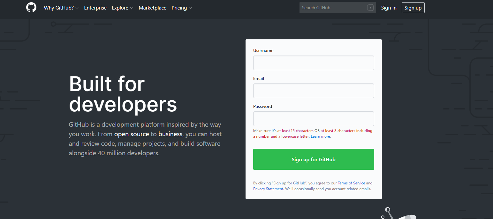
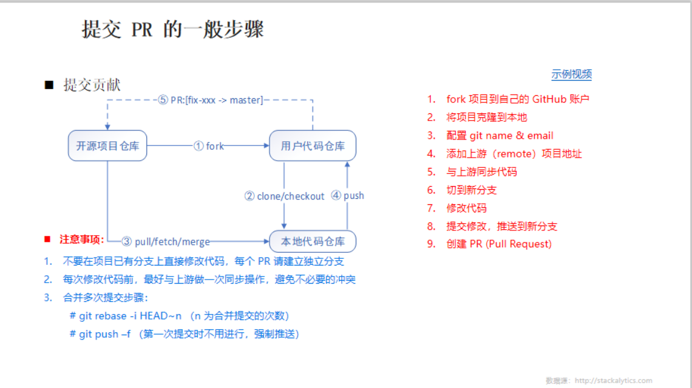
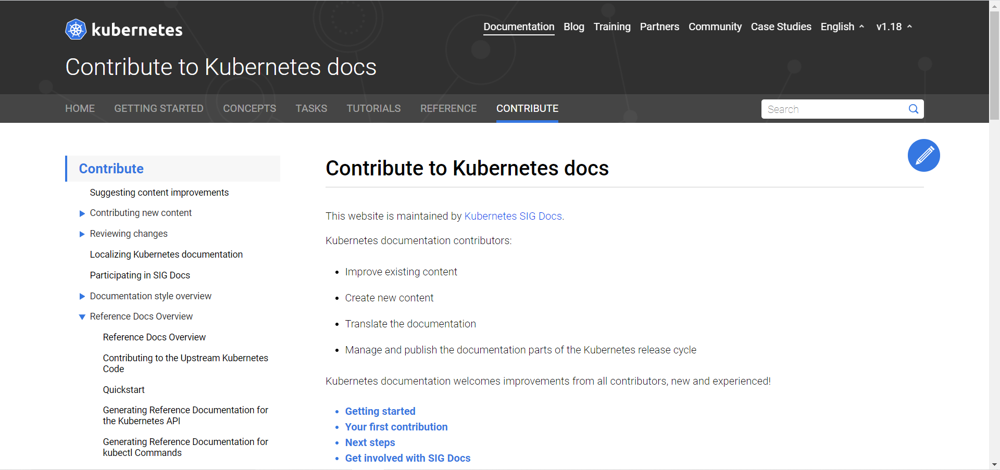
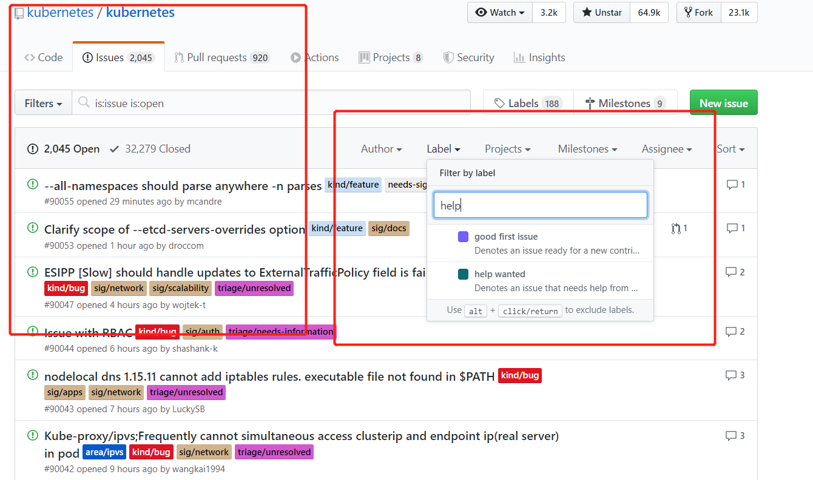
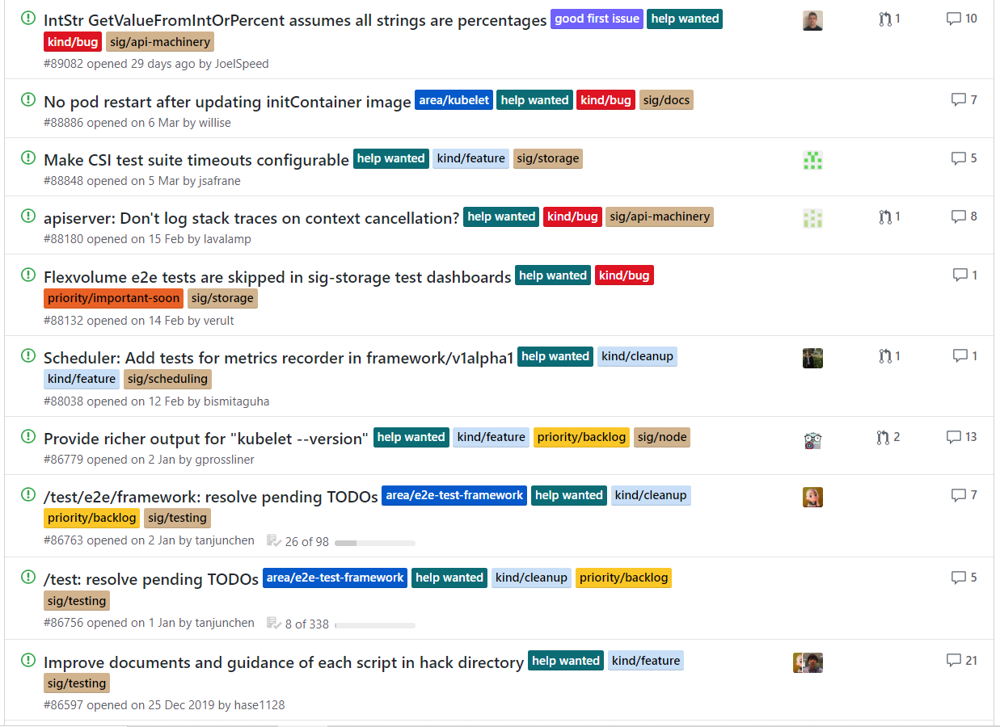

# 初识 CNCF

CNCF 是一个开源软件基金会，致力于使云原生计算具有普遍性和可持续性。 
云原生计算使用开源软件技术栈将应用程序部署为微服务，将每个部分打包到自己的容器中，并动态编排这些容器以优化资源利用率。 
云原生技术使软件开发人员能够更快地构建出色的产品。

具体详情可以参考以下网址

* [英文官网](https://www.cncf.io/)
* [中文社区](https://www.kubernetes.org.cn/)

# CNCF DashBoard 展示

其中 [cncf/devstats](https://github.com/cncf/devstats) 罗列世界上活跃于 CNCF 组织的各个公司以及非营利组织与个人。

Grafana 展示效果：

# 贡献准备

## 注册 GitHub & 签署 CNCF-CLA

* 注册 GitHub 账户
    [注册 Github](https://github.com/)

    
    
    提倡 @gmail.com @163.com 等邮箱注册 , 尽量避免 QQ 邮箱。*避免以后关联 Slack 出现问题* 
* 签署 CNCF-CLA 协议
    
    登录 [linuxfoundation](https://identity.linuxfoundation.org/) 进行注册以及签署协议。

    

***签署 CLA 协议的邮箱应该与 Git 客户端本地配置邮箱保持一致，否则验证不过。
访问 CLA 签署网站需要科学上网。
所注册邮箱不推荐使用 QQ 邮箱。***

具体流程可以参考：**[官方指导](https://github.com/kubernetes/community/blob/master/CLA.md#the-contributor-license-agreement)**

# 参与贡献

## 熟悉 PR 流程

详情参考官网(website)：https://kubernetes.io/docs/contribute/

## 以 CNCF Kubernetes 为例

向 Kubernetes 提交 issue/pr，详见 https://github.com/kubernetes/community/#contribute

### Linux 开发环境

熟悉基本 Linux 操作、Git 操作

推荐 [Git](https://git-scm.com/docs) 操作教程

***熟悉 Git 操作必不可少***

### 开始第一个贡献

如何向 Kubernetes 贡献你的第一个贡献呢？

如上图所示，在 Issues 中输入 `help` 或者 `good first issue` 进行过滤，新手一般都是从这里开始参与社区贡献之门。

### 进阶之路

参见 [贡献指南](https://github.com/kubernetes/community/blob/master/contributors/guide/README.md#open-a-pull-request)

关注 kubernetes 其他仓库，如 [enhancements](https://github.com/kubernetes/enhancements) [community](https://github.com/kubernetes/community) [website](https://github.com/kubernetes/website)

enhancements 有关最近 kk 以及未来的发展方向、community 有关 kk 的各种规章制度、website 表示 kk 官网

加入 kk 社区的 [Slack](https://kubernetes.slack.com/messages/sig-docs) 频道

进阶方向
研究 kubernetes 源码，关注 [KEPS](https://github.com/kubernetes/enhancements/tree/master/keps#kubernetes-enhancement-proposals-keps)。参与相关 [线上会议](https://github.com/kubernetes/community/tree/master/communication#community-groups)。

# kubernetes 汉化

kubernetes 汉化 https://github.com/k8smeetup

[K8SMeetup 翻译流程与翻译校稿规范](https://github.com/k8smeetup/k8s-official-translation#k8smeetup-%E7%BF%BB%E8%AF%91%E6%B5%81%E7%A8%8B%E4%B8%8E%E7%BF%BB%E8%AF%91%E6%A0%A1%E7%A8%BF%E8%A7%84%E8%8C%83)

# Istio 汉化

Istio 汉化 https://github.com/servicemesher

[Istio 官方文档翻译指导手册](https://github.com/servicemesher/istio-official-translation#istio%E5%AE%98%E6%96%B9%E6%96%87%E6%A1%A3%E7%BF%BB%E8%AF%91%E6%8C%87%E5%AF%BC%E6%89%8B%E5%86%8C)

# Github 常用语

见 [Github 常用语](github-language.md#github-language)