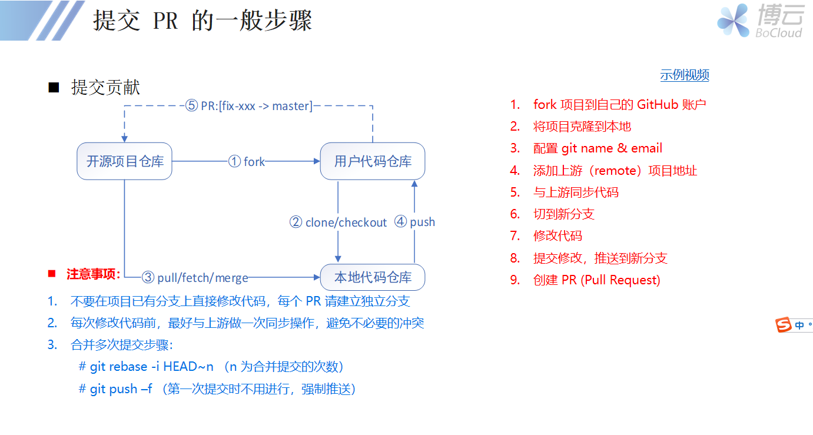

# 初识 CNCF

CNCF 是一个开源软件基金会，致力于使云原生计算具有普遍性和可持续性。 云原生计算使用开源软件技术栈将应用程序部署为微服务，将每个部分打包到自己的容器中，并动态编排这些容器以优化资源利用率。 云原生技术使软件开发人员能够更快地构建出色的产品。

具体详情可以参考以下网址

* [英文官网](https://www.cncf.io/)
* [中文社区](https://www.kubernetes.org.cn/)
* [cncf 社区活跃度](https://www.stackalytics.com/cncf)

    罗列世界上活跃于 CNCF 组织的各个公司以及非营利组织与个人。

# 贡献准备

## 注册 GitHub & 签署 CNCF-CLA

* 注册 GitHub 账户
    [注册 Github](https://github.com/)

    
    
    提倡 @gmail.com @163.com 等邮箱注册 , 尽量避免 QQ 邮箱。*避免以后关联 Slack 出现问题* 
* 签署 CNCF-CLA 协议
    
    登录 [linuxfoundation](https://identity.linuxfoundation.org/) 进行注册以及签署协议。

    

* 注册相关账号
    
    [launchpad](https://launchpad.net/openstack)
    [review](https://review.opendev.org/)
    [openstack](https://www.openstack.org/)
    
    Openstack 是官方网站 , Launchpad 是用来管理版本以及相关 BUG , review 是代码 review 网站。实际只需要三个账号 , 其中 Launchpad 和 review 两个网站共用同一个 Ubuntu 账号. 唯一值得注意的是，注册账号时最好使用相同的邮箱，可以免去许多不必要的麻烦. 如需科学上网，自备梯子。

* 关联公司 CNCF 组织
    具体详情可参见 PPT 以及视频。
    在视频中修改 https://opendev.org/x/stackalytics/ 项目中的 `etc/default_data.json` 文件时，注意格式问题，参照 
    https://opendev.org/x/stackalytics/src/branch/master/etc/default_data.json#L18103 按照前面注册 launchpad 的 launchpad_id 首字母排序。

***签署 CLA 协议的邮箱应该与 Git 客户端本地配置邮箱保持一致，否则验证不过。
访问 CLA 签署网站需要科学上网。
所注册邮箱不推荐使用 QQ 邮箱。***

# 参与贡献

## 熟悉 PR 流程

## 以 CNCF Kubernetes 为例

### Linux 开发环境

熟悉基本 Linux 操作、Git 操作

推荐 [Git](https://git-scm.com/docs) 操作教程

***熟悉 Git 操作必不可少***

### 如何贡献

参考 [Kubernetes Website](https://kubernetes.io/docs/contribute/) 介绍如何贡献代码。

### 开始第一个贡献
    
* typo codespell
* shellcheck staticcheck
* 其他

1. Kubernetes 及其很多开源项目其实都集成了检查工具 misspell，
关于 typo 参考[案例](https://github.com/kubernetes/kubernetes/pull/78820) 推荐 codespell 检测工具(Python 编写，功能强大)。typo 修改太少或者修改的不对，别人可能让你怎么修改，你按照要求进行修改就行。
1. staticcheck 静态检查 详细步骤参考 [staticcheck](https://github.com/kubernetes/kubernetes/issues/81657)。
具体格式参考最近被合并的 PR。
1. golint 问题，参考 [golint](https://github.com/kubernetes/kubernetes/issues/68026), 格式要求与静态检查类似。
1. 其他很好的 good first issue , 参考链接[入门案例](https://github.com/kubernetes/kubernetes/issues?q=is%3Aopen+is%3Aissue+label%3A%22good+first+issue%22)，其他仓库类似。
1. 可以关注的人员 [Rainbowmango](https://github.com/kubernetes/kubernetes/pulls/Rainbowmango) [SataQiu](https://github.com/kubernetes/kubernetes/pulls/SataQiu) [oomichi](https://github.com/kubernetes/kubernetes/pulls/oomichi) [haosdent](https://github.com/kubernetes/kubernetes/pulls/haosdent) [alejandrox1](https://github.com/kubernetes/kubernetes/pulls?q=is%3Apr+author%3Aalejandrox1+is%3Aclosed) 以及其他社区活跃者与 approver。

# 进阶之路

[贡献指南](https://github.com/kubernetes/community/blob/master/contributors/guide/README.md#open-a-pull-request)
贡献一段时间后，我们应当朝着更高的目标前进。

申请成为 member、reviewer、approver 具体详情参考[Community membership](https://github.com/kubernetes/community/blob/master/community-membership.md)

关注 kubernetes 其他仓库，如 [enhancements](https://github.com/kubernetes/enhancements) [community](https://github.com/kubernetes/community) [website](https://github.com/kubernetes/website)

enhancements 有关最近 kk 的工作以及未来重构方向、community 有关 kk 的各种规章制度、website kk 官网

加入 kk 社区的 [Slack](https://kubernetes.slack.com/messages/sig-docs) 频道

进阶方向
研究 kubernetes 源码，关注 [KEPS](https://github.com/kubernetes/enhancements/tree/master/keps#kubernetes-enhancement-proposals-keps)。参与相关[线上会议](https://github.com/kubernetes/community/tree/master/communication#community-groups)。

# ServiceMesher - Istio

有待补充

# kubernetes 汉化

kubernetes 汉化 https://github.com/k8smeetup

[K8SMeetup 翻译流程与翻译校稿规范](https://github.com/k8smeetup/k8s-official-translation#k8smeetup-%E7%BF%BB%E8%AF%91%E6%B5%81%E7%A8%8B%E4%B8%8E%E7%BF%BB%E8%AF%91%E6%A0%A1%E7%A8%BF%E8%A7%84%E8%8C%83)

# Istio 汉化

Istio 汉化 https://github.com/servicemesher

[Istio官方文档翻译指导手册](https://github.com/servicemesher/istio-official-translation#istio%E5%AE%98%E6%96%B9%E6%96%87%E6%A1%A3%E7%BF%BB%E8%AF%91%E6%8C%87%E5%AF%BC%E6%89%8B%E5%86%8C)