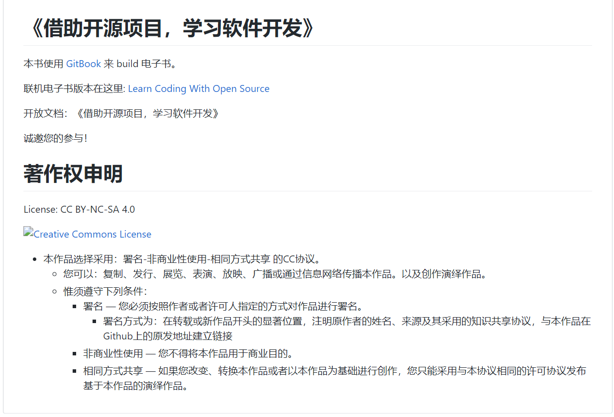
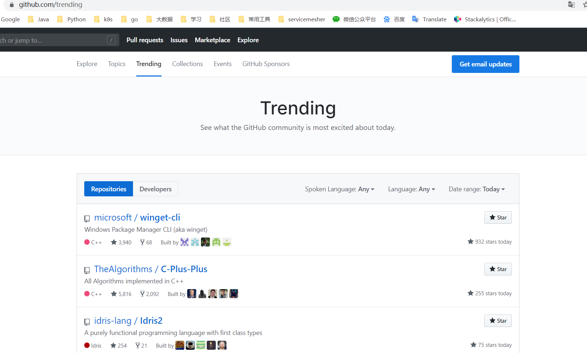
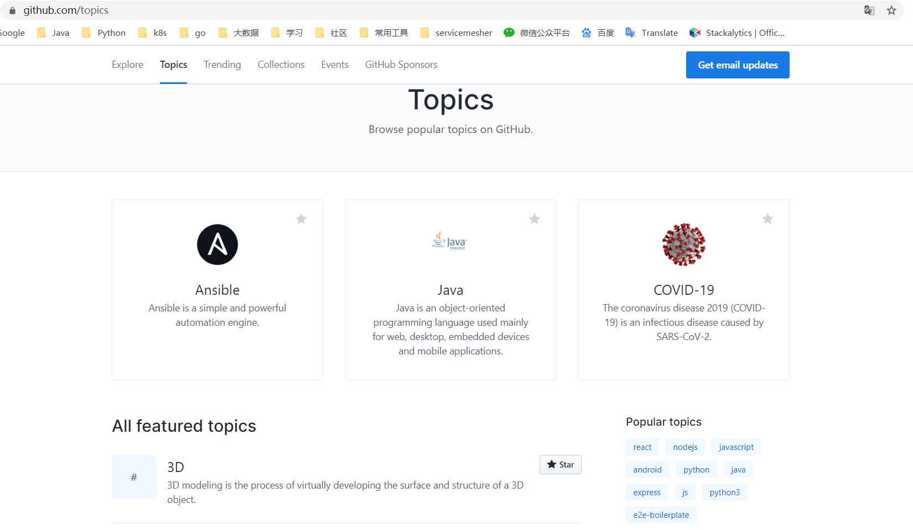
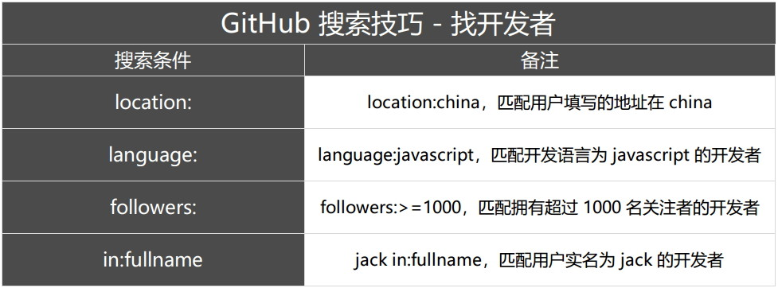
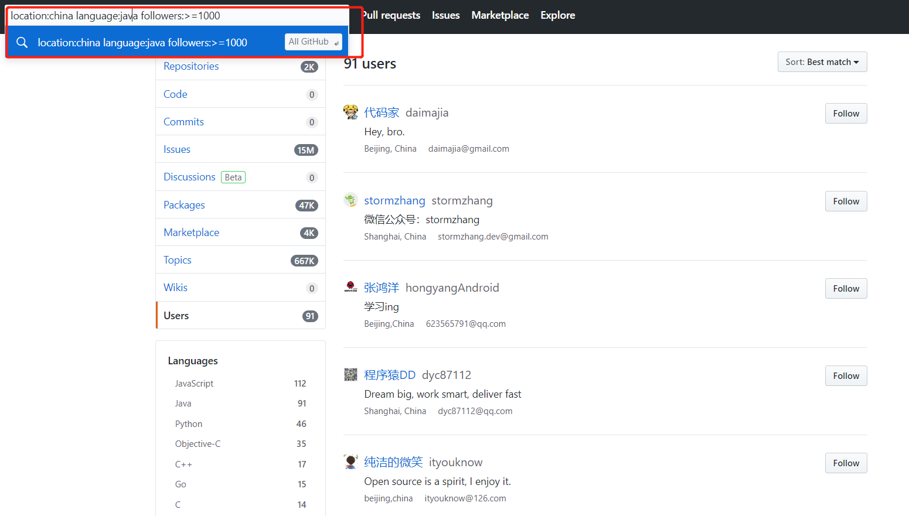
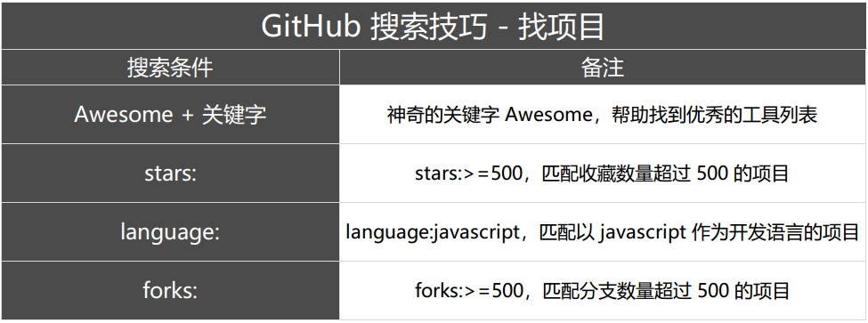

# 开源社区

***[借助开源项目，学习软件开发](https://github.com/zhuangbiaowei/learn-with-open-source)***

## 介绍

[百度百科] 开源社区又称开放源代码社区，一般由拥有共同兴趣爱好的人所组成，根据相应的开源软件许可证协议公布软件源代码的网络平台，同时也为网络成员提供一个自由学习交流的空间。由于开放源码软件主要被散布在全世界的编程者所开发，开源社区就成了他们沟通交流的必要途径，因此开源社区在推动开源软件发展的过程中起着巨大的作用。

在如今的软件设计，架构及开发中，开源扮演着越来越重要的角色。

作为开发工程师，服务器、数据库、各种编程语言和框架的源代码，我们可以随时利用这些开源技术实现自己的业务要求。其中，方便且免费地使用这些技术，当然离不开上述各种技术的开源，当今世界，这是一个开源的时代，所以，我们应该主动拥抱开源，工作之余了解与学习开源社区那些事。

## 开源社区分类

其实，开源社区已经存在许久啦，但是对于我和一些人来说，可能比较新奇，所以本文介绍了一些开源社区的概念、如何参与社区、为什么要参与社区？

[CNCF 基金会](https://www.cncf.io/)

[kubernetes](https://github.com/kubernetes/kubernetes)、[prometheus](https://github.com/prometheus/prometheus)、[Dragonfly](https://github.com/dragonflyoss/Dragonfly) 等。

[Apache 软件基金会](https://www.apache.org/)   [Apache 项目列表](http://www.apache.org/index.html#projects-list)

如 [Kafka](https://github.com/apache/kafka)、[ZooKeeper](https://github.com/apache/zookeeper)、[Hive](https://github.com/apache/hive) 等。

[TensorFlow](http://www.tensorfly.cn/)

...... 等等，开源社区很多，找到适合自己的才是最好的。

## 如何挑选开源社区

这里简单地列出了几个条件：

1. 社区/项目方向是否符合你的期望/兴趣。比如希望更多关注在后端领域，那很多前端方向的开源项目就可以放弃。
1. 社区/项目的技术栈是否与你匹配，匹配的技术栈可以使你以更快的速度熟悉代码。技术栈包括编程语言、采用的框架或者库等。
1. 社区接纳新人的友好程度。这对于初入开源，而且并不以开源为生的新人来说，是非常重要的。对于新人来说，开源的贡献活动并不能带给他们任何短期可见的回报，因此需要友好的社区来给予他们正面的反馈，使得贡献活动进入一个良性循环。友好程度，有很多地方可以反映，比如项目是否有清晰易懂的贡献指南，是否具有完善的 CI/CD 支持，是否有完善的晋升路线（新贡献者 - Reviewer - Commiter - Maintainer 等），是否可以简单直接地直接接触到项目的维护人员，有完善的答疑渠道等方面。不过要注意，友好程度跟项目的受欢迎程度是两回事，受欢迎（Star 多）的项目未必有一个友好的社区。一个额外的小建议，刚开始参与开源时，不要选择公司开源的开源项目进行贡献。公司开源的项目通常会不如社区驱动的开源项目友好。
1. 是否是使用过或者熟悉的开源项目。一个好的贡献者也是一个好的用户。如果之前就有使用过的开源项目，会免去熟悉的过程。

最后，在我看来，选择的优先级是：[1] > [3] > [4] > [2]。因为方向无论如何是最重要的，在确定方向后，社区的友好程度应该是更加值得考虑的，这也是我在接触开源以后才发现的。最后，是技术栈的熟悉程度。个人认为，编程语言等等的选择，相对不是那么重要的。如果是 Java 后端的话，可能 Apache or Eclipse 基金会下那一堆开源项目或者 Spring 等等，会比较合适。

整理于知乎话题 [在校生如何在开源社区中成长？](https://www.zhihu.com/question/336820269/answer/851806875)

## 如何参与开源社区

这里以 CNCF 为例，举例说明如何参与 CNCF Kubernetes 开源社区。

### 参与社区

如何参加 CNCF 等开源社区呢？如何向 Kubernetes 等开源仓库提交贡献呢？这里提供一点参考！

### 初识 CNCF

CNCF 是一个开源软件基金会，致力于使云原生计算具有普遍性和可持续性。 
云原生计算使用开源软件技术栈将应用程序部署为微服务，将每个部分打包到自己的容器中，并动态编排这些容器以优化资源利用率。 
云原生技术使软件开发人员能够更快地构建出色的产品。

具体详情可以参考以下网址

* [英文官网](https://www.cncf.io/)

* [中文社区](https://www.kubernetes.org.cn/)

### CNCF DashBoard 展示

其中 [cncf/devstats](https://github.com/cncf/devstats) 罗列世界上活跃于 CNCF 组织的各个公司以及非营利组织与个人。

Grafana 展示效果：

### 贡献准备

### 注册 GitHub & 签署 CNCF-CLA

* 注册 GitHub 账户
    [注册 Github](https://github.com/)

    
    
    提倡 @gmail.com @163.com 等邮箱注册 , 尽量避免 QQ 邮箱。*避免以后关联 Slack 出现问题* 
* 签署 CNCF-CLA 协议
    
    登录 [linuxfoundation](https://identity.linuxfoundation.org/) 进行注册以及签署协议。

    

***签署 CLA 协议的邮箱应该与 Git 客户端本地配置邮箱保持一致，否则验证不过。
访问 CLA 签署网站需要科学上网。
所注册邮箱不推荐使用 QQ 邮箱。***

具体流程可以参考：**[官方指导](https://github.com/kubernetes/community/blob/master/CLA.md#the-contributor-license-agreement)**

### 参与贡献

### 知识必备

[SIGs and Working Groups](https://github.com/kubernetes/community/blob/master/sig-list.md#sigs-and-working-groups)，
它们是 Kubernetes 社区中关注特定模块的组织，Kubernetes 作为一个拥有几十万行源代码的项目，某些小组专门负责不同的某块，如网络、调度、安全等。

目前主要有 API Machinery、Apps、Architecture、Auth、Autoscaling、CLI、Cloud Provider、Cluster Lifecycle、Contributor Experience、Docs、Instrumentation、Multicluster、Network、Node、Release、Scalability、Scheduling、Service Catalog、Storage、Storage、Testing、UI、Usability、Windows。

### 熟悉 PR 流程

详情参考官网(website)：https://kubernetes.io/docs/contribute/

### 以 CNCF Kubernetes 为例

向 Kubernetes 提交 issue/pr，详见 https://github.com/kubernetes/community/#contribute

### Linux 开发环境

熟悉基本 Linux 操作、Git 操作

推荐 [Git](https://git-scm.com/docs) 操作教程

***熟悉 Git 操作必不可少***

### 开始第一个贡献

如何向 Kubernetes 贡献你的第一个贡献呢？

如上图所示，在 Issues 中输入 `help` 或者 `good first issue` 进行过滤，新手一般都是从这里开始参与社区贡献之门。

### 进阶之路

参见 [贡献指南](https://github.com/kubernetes/community/blob/master/contributors/guide/README.md#open-a-pull-request)

关注 kubernetes 其他仓库，如 [enhancements](https://github.com/kubernetes/enhancements) [community](https://github.com/kubernetes/community) [website](https://github.com/kubernetes/website)

enhancements 有关最近 kk 以及未来的发展方向、community 有关 kk 的各种规章制度、website 表示 kk 官网

加入 kk 社区的 [Slack](https://kubernetes.slack.com/messages/sig-docs) 频道

进阶方向

[KEP](https://github.com/kubernetes/enhancements/tree/master/keps#kubernetes-enhancement-proposals-keps) 的全称是 Kubernetes Enhancement Proposal，因为 Kubernetes 目前已经是比较成熟的项目了，所有的变更都会影响下游的使用者，对于功能和 API 的修改都需要先在 kubernetes/enhancements 仓库对应 SIG 的目录下提交提案才能实施，所有的提案都必须经过讨论、通过社区 SIG Leader 的批准。

研究 kubernetes 源码，关注 [KEPS](https://github.com/kubernetes/enhancements/tree/master/keps#kubernetes-enhancement-proposals-keps)。参与相关 [线上会议](https://github.com/kubernetes/community/tree/master/communication#community-groups)。

### kubernetes 汉化

kubernetes 汉化 https://github.com/k8smeetup

[K8SMeetup 翻译流程与翻译校稿规范](https://github.com/k8smeetup/k8s-official-translation#k8smeetup-%E7%BF%BB%E8%AF%91%E6%B5%81%E7%A8%8B%E4%B8%8E%E7%BF%BB%E8%AF%91%E6%A0%A1%E7%A8%BF%E8%A7%84%E8%8C%83)

### Istio 汉化

Istio 汉化 https://github.com/servicemesher

[Istio 官方文档翻译指导手册](https://github.com/servicemesher/istio-official-translation#istio%E5%AE%98%E6%96%B9%E6%96%87%E6%A1%A3%E7%BF%BB%E8%AF%91%E6%8C%87%E5%AF%BC%E6%89%8B%E5%86%8C)

### Github 常用语

见 [Github 常用语](github-language.md#github-language)

### Github 常见 Topic

[GitHub Trend](https://github.com/trending) 页面总结了每天/每周/每月周期的热门 Repositories 和 Developers，你可以看到在某个周期处于热门状态的开发项目和开发者。而 [GitHub Topic](https://github.com/topics) 展示了最新和最流行的讨论主题，在这里你不仅能够看到开发项目，还能看到更多非开发技术的讨论主题，比如 Job、Chrome 浏览器等。

## 期待与收获

Kubernetes 目前已经是云时代的操作系统，作为容器编排领域的事实标准和云原生领域的 Boss，学习与了解 Kubernetes 的使用和原理成为云原生时代开发工程师的必备技能。

开源社区如此之多，选择自己感兴趣的或者对自己从事的工作有帮助的是最好不过的啦，开源与工作相结合是比较推崇的，既可以提升平时工作的效率(社区中比较好用的工具应用到工作中)，也可以提升对开源社区的兴趣(比如你对某项开源项目中的某个 topic 或 issue 感兴趣，则可以尝试用自己所掌握的知识去实现它)。从不同的社区中我们能够学习到不同的东西，比如：社区的管理与运作方式、提升某项技能、增强编码能力与编码规范。

在开源社区能够收获什么呢？

1. 提升编码水平与编码规范。
1. 与世界上最优秀的工程师们交流，能够开拓视野，如 k8s 新增一项功能，必须严格遵循 alpha -> beta -> release -> GA 等阶段、e2e 测试、编写完整的文档、代码注释。
1. 可以快速理解项目的实现原理以及工作流程，提升工作效率，提升个人水平。
1. 大厂加分项。
1. ......

## Github 得力助手

在 Github 上有很多的项目，我们应该如何去抉择呢？有很多种方式提高我们的搜索效率。

如：搜索某个用户：

location:china language:java followers:>=1000

搜索某个项目

awesome:高并发  language:java starts:>=500 forks:200

## 源码之旅 - 题外话

学习与阅读源码是一门苦差事，参与开源社区也需要耐心与持之以恒的决心。

1. 后端开发者，尤其是 Java Web 从事者，不知是否听说过访问量 3 百万 + 的 [芋道源码](https://github.com/YunaiV)。

1. 前端开发者不知是否知道[司徒正美](https://github.com/RubyLouvre ) JavaScript 专家，开源框架 avalon 创始人。

## 总结

我参与 Kubernetes 社区，从中学习到了很多，比如不仅学习到了 Go 语言的开发规范、庞大的开源社区的治理方式，还从社区中的很多优秀工程师身上学到了软件设计的一些技巧，与优秀的开发者交流提高了我的见解，这些都是在日常工作中很难得到的。可能与我们平时的工作内容相关，毕竟大部分集中于业务开发，框架的使用。优秀的开源社区和项目中真的是值得我们去学习与借鉴，等着我们去挖掘和学习。加入开源社区吧、后浪们！！！

